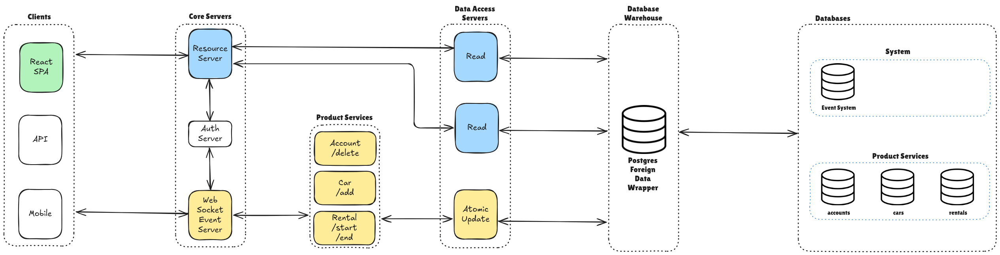

# Summary
This is a template that wraps a product integration for live event data in React web applications.

I am adding a component to my product toolkit.

My goal is to make this production ready and keep it as a template.

This is a work in progress.

# Why
When I am using any app, I think it stinks to have to wait for requests to finish before I can do something else.

I want to enhance the user experience by leveraging Web Sockets and providing live event data to React applications.


# Compatibility
I wanted to use [WebTransport](https://developer.mozilla.org/en-US/docs/Web/API/WebTransport#browser_compatibility) Web API like the community suggests, but it is not currently compatible with Safari/Safari Mobile/Safari WebView.

So I chose [WebSockets](https://developer.mozilla.org/en-US/docs/Web/API/WebSockets_API#browser_compatibility) Web API in the front end and I'll just have to stick with HTTP/1.1 for now.

I am using the [npm ws package](https://www.npmjs.com/package/ws) for the backend.
It was written according to the [Internet Engineering Task Force (IETF) RFC-6455 Web Socket Protocol](https://datatracker.ietf.org/doc/html/rfc6455).

It is awesome.

# Architecture and Design


### Data Access Layer

The "Data Warehouse" is just a database with the [Postgres Foreign Data Wrapper (FDW)](https://www.postgresql.org/docs/current/postgres-fdw.html) configured.

This way we can scale with a business by breaking different parts of it into different databases and have the warehouse join them all in 1 database using foreign tables.

There are 2 categories that databases belong to:
1. System

    State related to system configurations like jobs subscribing to events and event validation rules.

2. Product Services

    State related to each micro-service.
    
    Each micro-service will have it's own database.


<details>
<summary>Example: Creating Postgres Foreign Data Wrapper (FDW)</summary>

```
-- Create remote schema to match foreign schema.
-- Set the search path to the remote schema created.
set search_path to web_socket_event_system_events;

-- Now the extension will be created in the remote schema just created.
create extension if not exists postgres_fdw;

CREATE SERVER gateway_event_server
FOREIGN DATA WRAPPER postgres_fdw
OPTIONS (host 'localhost', dbname 'web_socket_event_system', port '5432');

CREATE USER MAPPING FOR admin
SERVER gateway_event_server
OPTIONS (user 'admin', password 'password');

 -- Create whatever enums (types)/functions exist in the foreign database
 -- within this remote database
CREATE TYPE web_socket_event_system_events.event_label AS ENUM ('update_user_profile');

IMPORT FOREIGN SCHEMA web_socket_event_system_events
FROM SERVER gateway_event_server
INTO web_socket_event_system_events;

select * from web_socket_event_system_events.rules;

-- View all foreign servers.
-- select * from pg_foreign_server

```
</details>
<br/>
<br/>

# Contributing (TBD)

## Install Dependencies
(TBD)

## Building the Projects
(TBD)

## Running the tests
(TBD)

### Regression/Smoke Tests
### Unit Tests
### End to End Tests